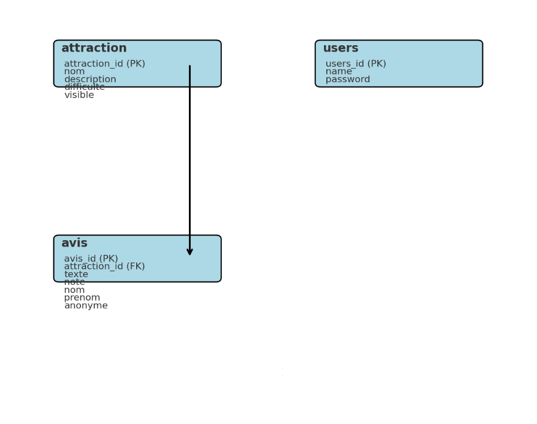

# 🎢 PARC_ATTRACTION - Lantz Nathan  
**Auteurs** : LANTZ Nathan 

## 🚀 Environnement utilisé  
- **GitHub** et **Docker** pour la gestion du projet et des conteneurs.  

---

## 🎉 Bienvenue dans mon projet  
Vous trouverez ici tout le contenu du site Parc-Attraction. Ce document détaille les éléments et fichiers disponibles dans ce dépôt.

---

### 🌐 1. Dossier `parc`  
Contient tout le code côté client, développé avec **Angular**.  

- Les fichiers applicatifs sont situés dans `parc/src/app/` :  
  - **HTML** : Structure des pages.  
  - **SCSS** : Styles de l'application.  
  - **TS** : Logique métier.  
  - **Spec.ts** : Tests unitaires.  
- Un fichier `Dockerfile` est présent pour construire l'application Angular, accessible via [http://localhost:4200](http://localhost:4200).  

---

### 🔧 2. Dossier `python`  
Contient tout le code côté serveur, développé avec **Python**.  

- **Code serveur** : Situé dans `python/app.py`, il gère l'API et lance le serveur sur [http://localhost:5000](http://localhost:5000).  
- **Base de données** : Le fichier `sql_file/init.sql` contient les données pour créer les tables de la base de données.  
- **Dockerfile** : Permet de lancer le serveur via la commande `docker-compose up --build`.  

---

### 🗂️ 3. Racine du projet  
À la racine, vous trouverez le fichier **`docker-compose.yml`** qui orchestre les `Dockerfile` des dossiers `parc` et `python`, facilitant le lancement complet de l'application.  

---

## 🐳 Lancement du projet via Docker

1. Clonez le projet complet depuis GitHub ou alors télécharger le dossier en ZIP :  
   ```bash
   git clone https://github.com/NathanLANTZ57/PARC_ATTRACTION_LANTZ_NATHAN.git
   ```
2. Accédez à la racine du projet (le dossier contenant `parc`, et `python`).  
3. Ouvrez un terminal PowerShell.  
4. Lancez la commande suivante :  
   ```bash
   docker-compose up --build
   ```
5. Dans un terminal dans le fichier /python faire la commande suivante pour la bdd :  
   ```bash
   Python3 init.py
   ```

--- 

### 🗄️ 4. Schéma de la base de données



---

## 🚀 Améliorations futures

Voici quelques pistes d'amélioration pour rendre l'application plus complète et optimisée, avec une estimation du temps nécessaire pour chaque tâche :

### 🎨 1. Expérience utilisateur (UX/UI)
- **Amélioration du design** avec un style plus moderne et attractif _(3-5 jours)_.
- **Ajout d'un mode sombre** pour améliorer le confort visuel des utilisateurs _(2 jours)_.
- **Mise en place d'une accessibilité améliorée** (prise en charge des lecteurs d'écran, contraste renforcé, navigation clavier) _(4-6 jours)_.

### 🌍 2. Fonctionnalités supplémentaires
- **Ajout d’un système de favoris** permettant aux utilisateurs de sauvegarder leurs attractions préférées _(3 jours)_.
- **Ajout d'un système de notation plus détaillé** (ex : critères comme l'attente, la qualité de l'attraction, etc.) _(3-5 jours)_.
- **Mise en place d’un système de commentaires avec réponses** pour permettre des discussions entre utilisateurs _(5-7 jours)_.
- **Possibilité d’ajouter des photos et vidéos aux avis** pour enrichir les retours des visiteurs _(5-8 jours)_.

### 🔐 3. Sécurité et administration
- **Ajout de l'authentification OAuth (Google, Facebook, etc.)** pour simplifier l'inscription et la connexion _(4-6 jours)_.
- **Gestion des rôles et permissions** pour permettre aux administrateurs de modérer les avis _(3-5 jours)_.
- **Ajout d'un système de signalement des avis** en cas de contenu inapproprié _(3-4 jours)_.

### 🌐 4. Internationalisation et localisation
- **Ajout de nouvelles langues** en plus du français et de l’anglais (ex : espagnol, allemand, etc.) _(4-7 jours, selon le nombre de langues)_.
- **Détection automatique de la langue de l'utilisateur** selon ses préférences de navigateur _(2 jours)_.

### ⚡ 5. Performance et optimisation
- **Optimisation du chargement des attractions** via une pagination ou un chargement infini _(3-4 jours)_.
- **Mise en place d’un système de mise en cache** pour réduire les appels API et accélérer l’affichage des attractions _(3-5 jours)_.
- **Amélioration de la base de données** pour optimiser les requêtes et éviter les ralentissements _(4-6 jours)_.

### 📱 6. Accessibilité mobile
- **Développement d’une version mobile optimisée** ou d’une application mobile avec **React Native** _(7-15 jours)_.
- **Ajout d'un mode hors-ligne** permettant de consulter les attractions sans connexion Internet _(5-8 jours)_.

### 📊 7. Statistiques et analyse
- **Ajout d’un tableau de bord admin** pour suivre les avis, les attractions les plus populaires et les tendances des utilisateurs _(6-10 jours)_.
- **Mise en place de Google Analytics** pour suivre l'activité des visiteurs et améliorer l'expérience utilisateur _(2-3 jours)_.

Ces améliorations permettront d'enrichir l'expérience utilisateur et d'optimiser le fonctionnement de l'application. 🚀
